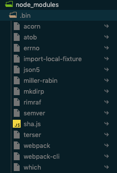
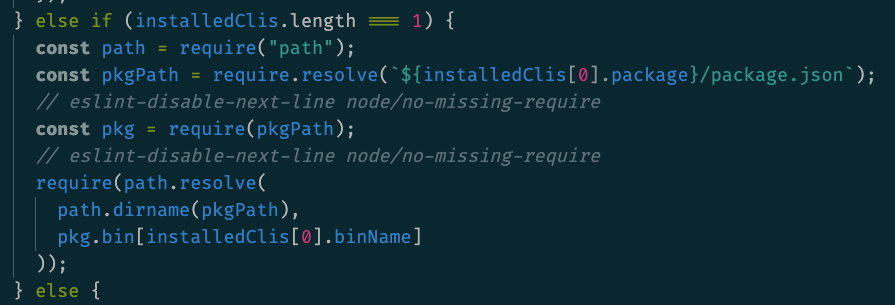
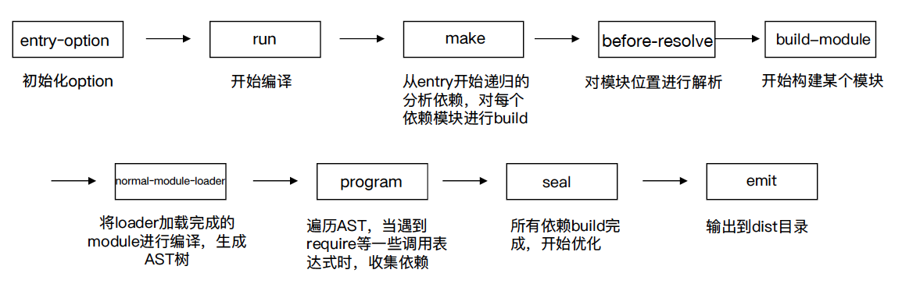

# 剖析 Webpack 运行流程

### 目标
- 了解 Webpack 运行流程

### webpack 流程概述
> Webpack 首先会把配置参数和命令行的参数及默认参数合并，并初始化需要使用的插件和配置插件等执行环境所需要的参数；初始化完成后会调用 Compiler 的 run 来真正启动 Webpack 编译构建过程，Webpack 的构建流程包括 compile、make、build、seal、emit 阶段，执行完这些阶段就完成了构建过程。

### 从 webpack 命令行说起
通过 npm scripts 运行 webpack 命令：

``` sh
# 开发环境
npm run dev

# 生产环境
npm run build
```

这个过程发生了什么呢？

在命令行运行命令后，npm 会让命令行工具进入`node_modules\.bin`目录下查找是否存在 webpack.sh 或者 webpack.cmd 文件，如果存在，就执行，不存在，就抛出错误。



### 分析 webpack 入口文件

webpack 实际入口文件是：`node_modules\webpack\bin\webpack.js`

入口文件代码结构及说明：

``` js
process.exitCode = 0; // 正常执行返回

const runCommand = (command, args) => {...}; // 运行某个命令

const isInstalled = packageName => {...}; // 判断某个包是否安装

const CLIs = [...]; // webpack 可用的 CLI: webpack-cli 和 webpack-command

const installedClis = CLIs.filter(cli => cli.installed); // 判断是否两个 CLI 是否都安装了

// 根据安装数量进行处理
if (installedClis.length === 0) {
  // ...
} else if (installedClis.length === 1) {
  // ...
} else {
  //...
}
```

### webpack 启动后
webpack 最终找到 webpack-cli (webpack-command) 这个 npm 包，并且执行 CLI。



### webpack-cli 处理的任务
- 引入 yargs，对命令行进行定制
- 分析命令行参数，对各个参数进行转换，组成编译配置项
- 引用 webpack，根据配置项进行编译和构建

#### 1. 命令行工具包 yargs
[https://github.com/yargs/yargs](https://github.com/yargs/yargs)
- 提供命令和分组参数
- 动态生成 help 帮助信息

#### 2. 组成编译配置项
解析 shell 与 config 中的配置项，用于激活 webpack 的加载项和插件。

#### 3 webpack-cli 执行的结果
webpack-cli 对配置文件和命令行参数进行转换最终生成配置选项参数 options。根据 options 调用 `webpack/lib/webpack.js` 实例化 compiler。

### 实例化 compiler
实例化 compiler 是在`webpack/lib/webpack.js`中完成的。

1. 首先会检查配置参数是否合法；
2. 然后根据传入的参数判断是否为数组，若是数组则创建多个 compiler，否则创建一个compiler；（以创建一个 compiler 为例）

### 构建流程
实例 compiler 后根据 options 的 watch 判断是否启动了 watch，如果启动 watch 了就调用 `compiler.watch` 来监控构建文件，否则启动 `compiler.run` 来构建文件。webpack 构建流程入口是 compiler 的 run 或者 watch 方法。

#### 1. compile
compile 阶段主要是为了进入 make 阶段做准备，make 阶段才是从入口开始递归查找构建模块。

#### 2. make
从 entry 开始递归去分析依赖，对每个依赖模块进行 build。

#### 3. normal-module-loader
将 loader 加载完成的 module 进行编译，生成 AST。

#### 4. program
遍历 AST，当遇到 require 等一些调用表达式时，收集依赖。

#### 5. seal
所有依赖 build 完成，开始优化。

#### 6. emit
输出到 dist 目录。

### 总体流程图


### 参考资料
- [webpack4源码分析](https://juejin.im/post/5c1859745188254fef232ead#comment)