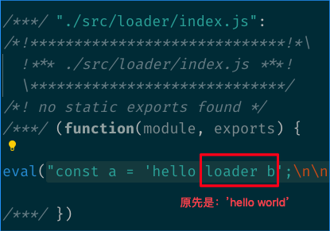

# Webpack Loader

### 目标
- 了解 Webpack Loader 的作用和原理
- 独立开发需要的 Loader

### 定义
> A loader is just a JavaScript module that exports a function.  

loader 只是一个导出为函数的 JavaScript 模块。

### loader 代码结构：

一个最简单的 loader 代码结构：

``` js
module.exports = function(source) {
  return source;
};
```

- 第一个 loader 的传入参数只有一个：资源文件(resource file)的内容。
- 另外还可以传递一个可选的 SourceMap 结果（格式为 JSON 对象）。

### loader runner
在开始了解 loader 工作流程前，先来了解一下什么是[`loader runner`](https://github.com/webpack/loader-runner)。 `loader runner`作为 webpack 的依赖，webpack 中使用它执行 loader。此外，loader-runner 允许不安装 webpack 的情况下运行 loaders。

loader-runner 的使用：
``` js
import { runLoaders } from 'loader-runner';

runLoaders({
  resource: '/abs/path/to/file.txt?query', // String: 资源的绝对路径(可以增加查询字符串)
  loaders: ['/abs/path/to/loader.js?query'], // String[]: loader 的绝对路径(可以增加查询字符串)
  context: { minimize: true }, // 基础上下文之外的额外 loader 上下文
  readResource: fs.readFile.bind(fs) // 读取资源的函数
}, function(err, result) {
  // err: Error?
  // result.result: Buffer | String
})
```

> 注意：resource 和 loaders 都是绝对路径

为了使用`loader runner`，编写一个简单的 loader 读取`demo.txt`的内容：

`raw-loader.js`文件：

``` js
module.exports = function(source) {
  const json = JSON.stringify(source)
  return json;
};
```

`demo.txt`文件：

``` txt
I am just a demo.
```

`index.js`文件：
``` js
const fs = require('fs');
const path = require('path');
const { runLoaders } = require('loader-runner');

runLoaders({
  resource: path.resolve(__dirname, 'demo.txt'),
  loaders: [path.resolve(__dirname, 'raw-loader.js')],
  readResource: fs.readFile.bind(fs),
}, (err, result) => (
  err ? console.error(err) : console.log(result)
));
```

最后，使用`index.js`执行程序：


### loader 整体工作流程

`loader runner`会调用 loader(导出的函数)，然后把上一个 loader 产生的结果或者资源文件(resource file)传入进去。依次类推，经过层层处理、传递。最后一个 loader 需要将产生的处理结果传递给 compiler。这个处理结果应该是 `String` 或者 `Buffer`（被转换为一个 string），代表了模块的 JavaScript 源码。

### 多个 loader 的执行顺序
如果有多个 loader 的配置，那 loader 的执行顺序是怎样的呢？先说结论：**多个 loader 串行执行，执行顺序从后到前。** 通过一个具体的例子来验证结论：

在`webpack.config.js`中配置：
``` js
{
  test: /\.js$/,
  use: [
    path.resolve('./src/loader/a-loader.js'),
    path.resolve('./src/loader/b-loader.js')
  ]
}
```

`b-loader.js`文件：
``` js
module.exports = function(source) {
  console.log('Loader b is excuted!');
  return source;
}
```

`a-loader.js`文件：
``` js
module.exports = function(source) {
  console.log('Loader a is excuted!');
  return source;
}
```

最后执行 webpack 编译：


可以清楚看到`b-loader`先于`a-loader`执行，验证了结论：**多个 loader 串行执行，执行顺序从后到前。** 多个 loader 执行时总是符合如下规则：
- 配置顺序最后的 loader 首先被调用，传给它的参数是 source 的内容；
- 处在中间的 loader 被链式调用，传给它们的是上个 loader 的返回值，为下一个 loader 提供输入；
- 配置顺序最开始的 loader 最后被调用，将产生的处理结果传递给 compiler。

以上的过程类似于：
- Unix 中的 pipline
- FP 中的 `compose = (f, g) => (...args) => f(g(...args));` (webpack 最类似的过程)

### loader 参数的获取
[官方文档配置 loader](https://webpack.js.org/api/loaders/) 有许多API，如果需要获取这些 loader 配置中的参数，还需要借助 webpack 依赖的[`loader-utils`](https://github.com/webpack/loader-utils)。通过一个例子来看它如何使用。

`webpack.config.js`
``` js
{
  test: /\.js$/,
  use: [
    path.resolve('./src/loader/a-loader.js'),
    {
      loader: path.resolve('./src/loader/b-loader.js'),
      options: {
        name: 'loader b'
      }
    }
  ]
}
```

`a-loader.js`和上面例子保持不变，`b-loader.js`需要做如下调整：

``` js
module.exports = function(source) {
  const { name } = loaderUtils.getOptions(this);
  console.log(name);
  return source;
};
```

执行 webpack 编译，可以看到已经将`option`中配置的`name`打印出来了：


### 同步/异步 loader
loader 是有同步和异步之分，上面介绍的 loader 都是同步的 loader，因为它们的处理流程都是同步的，转换完成后再返回结果。如果有处理流程是异步的，或者说由于采用同步处理会阻塞当前流程而不得不选择异步处理流程，这种情况下，该如何处理呢？还是通过一个例子去了解：

`webpack.config.js`、`a-loader.js`和上面例子保持一致。

修改`b-loader.js`的代码：
``` js
const loaderUtils = require('loader-utils');

module.exports = function (source) {
  const options = loaderUtils.getOptions(this);
  const callback = this.async();

  setTimeout(() => {
    const result = source.replace('world', options.name);
    callback(null, result);
  }, 1000);
}
```

需要编译的`index.js`文件如下：
``` js
const a = 'hello world';
```

最后执行 webpack 编译，可以看到源码中的`hello world`被转成`hello loader b`：



loader 的异步处理需要用到 `this.async`，它返回的是一个异步函数，第一个参数是 Error，第二个参数是处理的结果。

### loader 异常处理
- loader 内直接通过 throw 抛出
- 通过 this.callback 传递错误

this.callback 不仅可以用来传递错误，若需要返回多个结果，它也能派上用场。它的完整 API 如下：

``` js
this.callback(
  err: Error | null,
  content: string | Buffer,
  sourceMap?: SourceMap,
  meta?: any
);
```

1. 第一个参数必须是 Error 或者 null
2. 第二个参数是一个 string 或者 Buffer
3. 可选的：第三个参数必须是一个可以被这个模块解析的 source map
4. 可选的：第四个选项，会被 webpack 忽略，可以是任何东西（例如一些元数据）

### loader 处理二进制数据
在默认的情况下，webpack 传给 loader 的原内容都是 UTF-8 格式编码的字符串。 但有些场景下 loader 处理的是二进制文件，例如 file-loader。

``` js
module.exports = function(source) {
    // 在 exports.raw === true 时，Webpack 传给 Loader 的 source 是 Buffer 类型的
    source instanceof Buffer === true;
    // Loader 返回的类型也可以是 Buffer 类型的
    // 在 exports.raw !== true 时，Loader 也可以返回 Buffer 类型的结果
    return source;
};

// 通过 exports.raw 属性告诉 Webpack 该 Loader 是否需要二进制数据 
module.exports.raw = true;
```

关键代码`module.exports.raw = true;`才能让 loader 取得二进制数据，否则就只能是字符串

### loader 文件输出
通过`this.emitFile`进行文件写入，输出一个文件：

``` js
const loaderUtils = require("loader-utils");

module.exports = function(source) {
  const url = loaderUtils.interpolateName(this, "[hash].[ext]", {
    source,
  });
  this.emitFile(url, source);
  const path = `__webpack_public_path__ + ${JSON.stringify(url)};`;
  return `export default ${path}`;
};
```

### 在 loader 中使用缓存
如果每次构建都执行重复的转换操作，构建将会变得非常低效。 为此，webpack 会默认缓存所有 loader 的处理结果（有依赖的 loader 无法使用缓存）。只有在被处理的文件或者其依赖的文件发生变化时，才会重新调用对应的 loader 去执行转换操作的。可以使用`this.cacheable(false)`手动关掉缓存。

### 编写 loader 的 tips

#### 1. 模块化
由于 loader 就是一个导出的模块，编写时也应该遵循书写模块的规范及设计原则。

#### 2. 单一职责
SRP 原则体现为：一个对象（方法）只做一件事情。此外，模块之间还应该保持独立。

#### 3. 链式组合
在单一职责的前提下，使用链式组合去达到编写 loader 目标。

#### 4. 路径问题
不要在 loader 模块里写绝对路径，因为当项目根路径变了，这些路径会干扰 webpack 计算 hash（把 module 的路径转化为 module 的引用 id）。`loader-utils` 里有一个 `stringifyRequest` 方法，它可以把绝对路径转化为相对路径。

### 编写 loader 的应用场景
- 统一对 function 进行 ```try...catch..```处理；
- 国际化，特定内容转换等；
- more...