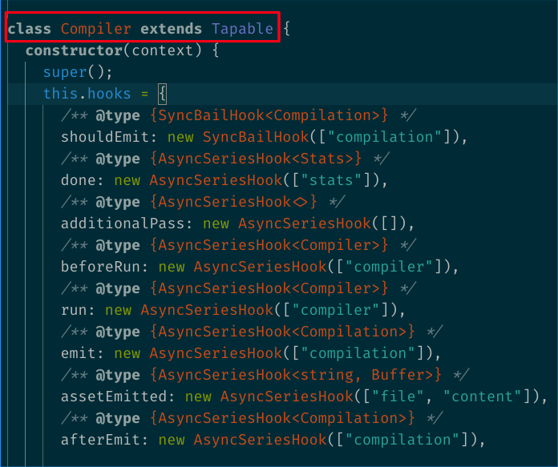
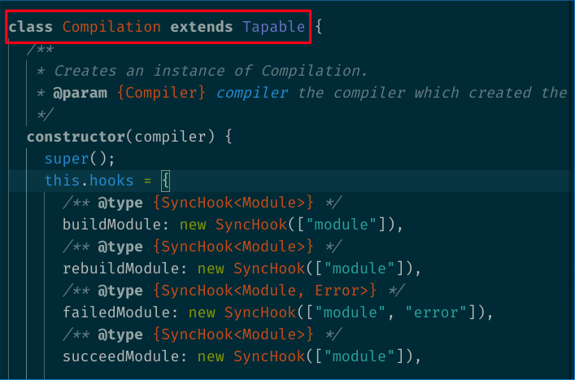
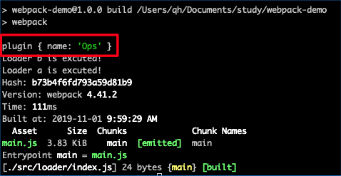

# Webpack Plugin

### 目标
- 了解 Webpack Plugin 的作用和原理
- 独立开发需要的 Plugin

### 定义
> A plugin is able to hook into key events that are fired throughout each compilation. Every step of the way, the plugin will have full access to the compiler and, when applicable, the current compilation.

plugin 能够 hook 到在每个编译中触发的所有关键事件。在编译的每一步，plugin 都具备完全访问 compiler 对象的能力，如果情况合适，还可以访问当前 compilation 对象。

### plugin VS loader
- loader 单纯用于转换某些类型的模块，plugin 可以用于执行范围更广的任务
- loader 的作用的过程有限，plugin 作用于整个构建过程。

### Tapable Plugin Framework
在深入了解 plugin 之前，有必要先来了解什么是[Tapable](https://github.com/webpack/tapable)。Tapable 是 webpack 插件架构的核心，极大简化了 webpack 的整体架构。虽然它作为 webpack 的依赖，但 Tapable 的优雅抽象使得我们可以单独使用它来构建其他微内核架构。这里不得不提一下，webpack 就是一个微内核架构的实现。

#### 微内核架构

> 微内核架构（Microkernel Architecture）也叫 Plugin Architecture，是一种基于插件的架构方式，通过编写精简的微内核来支撑以 plugin 的方式来添加更多丰富的功能。

微内核架构包含两个核心概念：**内核系统和插件模块** 。

- 内核系统：在高度抽象概念的基础上实现通用业务逻辑。
- 插件模块：包含特定的处理逻辑和自定义代码，用于增强或扩展微核心产生额外的业务功能。各个插件之间的功能都是各自独立。

微内核和插件之间的具体通信协议在架构模式层面并没有具体的限制，可以是在同一个进程内，也可以是分布式的，可以通过 Socket 通信，也可以通过 HTTP 通信等等。

#### Tapable

说回 Tapable，Tapable 是一个类似于 Node.js 的 EventEmitter 的库,主要是控制 hook 函数的发布与订阅，控制着 webpack 的插件系统。

下面 webpack 的部分源码可以清楚看到核心对象 Compiler、Compilation 都继承自 Tapable：




Tapable 暴露了很多 Hook 类，new 一个类方法获得为 plugin 提供的 hooks：

``` js
const {
  SyncHook,
  SyncBailHook,
  SyncWaterfallHook,
  SyncLoopHook,
  AsyncParallelHook,
  AsyncParallelBailHook,
  AsyncSeriesHook,
  AsyncSeriesBailHook,
  AsyncSeriesWaterfallHook
} = require("tapable");
```

名词解释：

|  type   | 描述  |
|  ----  | ----  |
| Hook  | 所有钩子的后缀 |
| Waterfall  | 同步方法，但是它会传值给下一个函数 |
| Bail  | 当函数没有任何返回值，就会在当前执行函数停止 |
| Loop  | 监听函数，返回true表示继续循环，返回undefined表示结束循环 |
| Sync  | 同步方法 |
| AsyncSeries  | 异步串行钩子 |
| AsyncParallel  | 异步并行执行钩子 |

看一个 Tapable 使用的实际例子：

``` js
const hook = new SyncHook(['arg1', 'arg2']);
//绑定事件到 webapck 事件流
hook.tap('hook', (arg1, arg2, arg3) => console.log(arg1, arg2)); // 'hello' 'world'
//执行绑定的事件
hook.call(hello', 'world');
```

Tabpack 提供了同步和异步绑定 hook 的方法，并且都有绑定事件和执行事件对应的方法。

|   Async*  |   Sync*   |
|  ----  | ----  |
|  绑定 tapAsync/tapPromise/tap  |   绑定 tap  |
|  执行 callAsync/promise  |   执行 call  |

### 运行环境
plugin 没有像 loader 那样的独立运行环境`loader runner`，只能在 webpack 里面运行。

### plugin 基本结构：

一个基本的 plugin 代码结构：

``` js
// 插件名称
class MyPlugin {
  apply(compiler) {
    compiler.hooks.done.tap(' My Plugin', (
      stats /* stats is passed as argument when done hook is tapped. */
    ) => {
      // 插件处理逻辑
      console.log('Hello World!');
    });
  }
}
module.exports = MyPlugin;
```

一个 plugin 的构成：
- 一个具名 JavaScript 函数。
- 在它的原型上定义 apply 方法。
- 指定一个触及到 webpack 本身的事件钩子。
- 操作 webpack 内部的实例特定数据。
- 在实现功能后调用 webpack 提供的 callback。

### 运行 plugin
实现 plugin 必要部分，将一个 plugin demo 运行来。

`demo-plugin.js`

``` js
module.exports = class DemoPlugin {
  constructor(options) {
    this.options = options;
  }
  // webpack 会调用 DemoPlugin 实例的 apply 方法给插件实例传入 compiler 对象
  apply(compiler)) {
    // 通过 compiler.plugin(事件名称, 回调函数) 监听到 Webpack 广播出来的事件
    compiler.plugin('compilation',function(compilation) {
      console.log('plugin', this.options);
    })
  }
};
```

`webpack.config.js`

``` js
+ const DemoPlugin = require('./src/plugin/demo-plugin.js');

+ plugins: [new DemoPlugin({ name: 'Ops' })],
```

### plugin 获取参数
上面的 demo 可以看到，plugin 获取参数直接**通过 plugin 的构造函数进行获取**。



### plugin 的错误处理
- 参数校验阶段可以直接 throw 的方式抛出

``` js
throw new Error('Error Message');
```

- 通过`compilation`对象的`warnings`和`errors`接收

``` js
compilation.warnings.push('warning');
compilation.errors.push('error');
```

### Compiler 和 Compilation
可以认为，plugin 的能力边界取决于我们对 webpack compiler 和每个独立的 compilation 的理解程度，它们是 Plugin 和 Webpack 之间的桥梁。

Compiler 和 Compilation 的含义如下：
- Compiler 对象包含了 webpack 环境所有的的配置信息，包含 options，loaders，plugins 这些信息，这个对象在 webpack 启动时候被实例化，它是全局唯一的，可以简单地把它理解为 webpack 实例；
- Compilation 对象包含了当前的模块资源、编译生成资源、变化的文件等。当 webpack 以开发模式运行时，每当检测到一个文件变化，一次新的 Compilation 将被创建。Compilation 对象也提供了很多事件回调供插件做扩展。通过 Compilation 也能读取到 Compiler 对象。

**Compiler 代表了整个 webpack 从启动到关闭的生命周期，而 Compilation 只是代表了一次新的编译。**